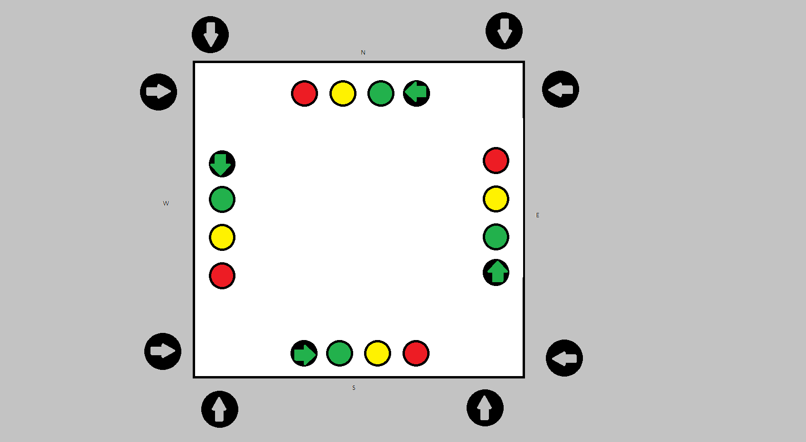
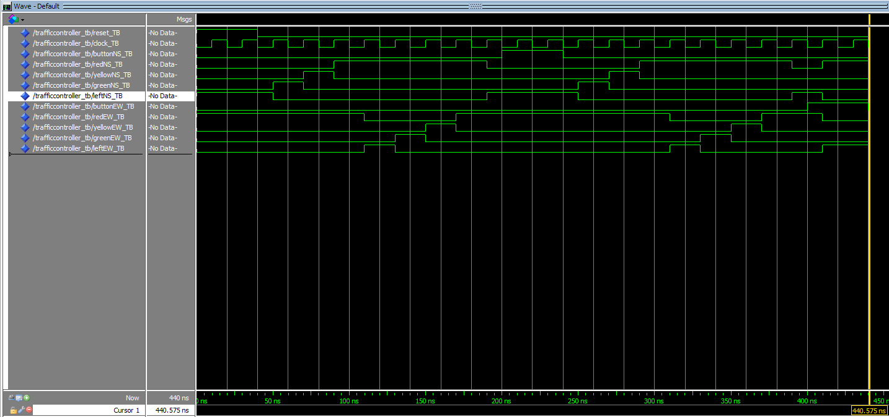

# Traffic-Controller

## Background
This project is to make a traffic controller on an FPGA using VHDL. The traffic controller will have buttons which pedestrians can press to change the lights to allow them to cross the street. The general idea of the physical system can be seen in Figure 1. A [Moore type finite state machine](https://en.wikipedia.org/wiki/Moore_machine) can be used for this system. The lights will be determined only by the state of the machine, thus making it Moore type fsm.

## Goals
This project will have the main VHDL file for digital system of the traffic controller. It will also contain a testbench file to verify the system. I also want to try using Python for verification, I will do this at the very end because I have never done that.

The VHDL code can be seen in *TrafficController.vhd*.
The testbench can be seen in *TrafficController_TB.vhd*.
If you have Quartus you can launch the project through *TrafficController.qpf*.

## Diagram
Figure 1: Physical representation of what the system might look like if I could build it on a PCB.


## Verification
To test *TrafficController_TB.vhd* you must open ModelSim. Then in the terminal enter the following:

```
vcom -93 -work work {C:/____/Traffic\ Controller/TrafficController_TB.vhd}
vsim TrafficController_TB
add wave *
run 440ns
```
Note: \ must be used before any spaces in file names.

If you change the want to test from the beginning again enter:

```
restart
run 440ns
```

It resulted in the following Waveform:


## Next Steps and Reflection
I want to make the FSM stay on certain states for a while e.g. stay on Yellow for 10 seconds, Green 1 minute, Left for 30 seconds. I am not exactly sure how to do this, so this is for the future. I also want to try to use Python for verification. Since I haven't ever done this I will also leave this for later.
Overall this was a very fun project. Good to get back into the grove of things.