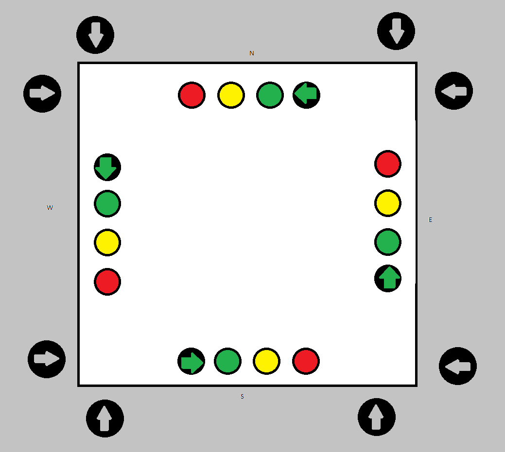

# Traffic-Controller

## Background
This project is to make a traffic controller on an FPGA using VHDL. The traffic controller will have buttons which pedestrians can press to change the lights to allow them to cross the street. The general idea of the physical system can be seen in Figure 1. The lights will be determined only by the state of the machine, thus making it a [Moore finite state machine](https://en.wikipedia.org/wiki/Moore_machine).

Figure 1: Physical representation of what the system might look like

The VHDL code can be seen in TrafficController.vhd, where as if you have Quartus you can launch the project through TrafficController.qpf